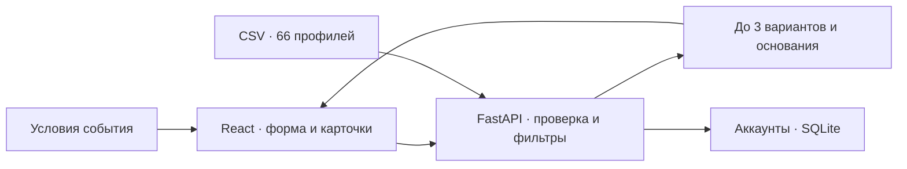

<div align="center">

# AI-ANA

### Подрядчики для события — с понятными основаниями выбора

<p>
  
  
  
  
</p>

**66 профилей · 7 фильтров · до 3 подходящих вариантов**

[Запуск](#быстрый-запуск) · [Возможности](#что-уже-работает) · [Демонстрация](#попробуйте-за-минуту) · [Документация](#документация)

</div>


## Какую проблему мы решаем

При организации события приходится вручную сопоставлять подрядчиков: кто работает в нужном городе, свободен на дату, поддерживает формат и укладывается в бюджет. Даже после отбора остаётся вопрос: **почему стоит рассмотреть именно эти варианты?**

**AI-ANA** собирает эти проверки в одном интерфейсе. Организатор задаёт условия и получает короткий список с объяснениями, основанными на данных профиля. Если вариантов нет, сервис показывает причины. Проект рассчитан на организаторов мероприятий, HR- и офис-менеджеров, а также тех, кто готовит собственное событие в Казахстане.

Мы реализовали полный путь от исходного каталога до результата в браузере: **проверка данных → подбор по условиям → объяснение выбора**. В текущей версии используются предоставленные данные; внешние AI-модели и платные API для запуска не нужны.

## Что уже работает

| Возможность | Что получает пользователь |
|---|---|
| **7 фильтров** | Город, категория, дата, формат события, бюджет, длительность и язык |
| **Автоматический подбор** | Выдача обновляется через 400 мс после последнего изменения; кнопка запускает поиск сразу |
| **Понятные карточки** | До трёх вариантов, начальная цена, особенности профиля и раскрываемые «Основания» |
| **Объяснение результата** | Причины исключения, отдельные состояния «нет подходящих» и «нет категории», сравнение при смене даты |
| **Работа с формой** | Готовые примеры, сброс фильтров, ошибки у полей и повтор запроса при техническом сбое |
| **Личный аккаунт** | Регистрация и вход по email и паролю, профиль с именем и городом, сохранение изменений и выход |
| **Оформление** | Адаптивный интерфейс, четыре цветовых пресета, свой HEX, палитра и сброс акцента |
| **Запуск в Docker** | Контейнеры сайта и API, автоматическое создание SQLite и сохранение аккаунтов в отдельном volume |

Подбор доступен без регистрации. При изменении условий старый запрос отменяется, а запоздалый ответ не заменяет новую выдачу. Настройки цвета сохраняются в браузере.

## Быстрый запуск

Нужны **Docker Desktop** или **Docker Engine с Compose**. Устанавливать Python и Node.js отдельно не требуется.

```bash
git clone https://github.com/BAITC-Hacks/hack-3c47c506-ai-ana.git
cd hack-3c47c506-ai-ana
docker compose up --build -d --wait
```

| Адрес | Назначение |
|---|---|
| **http://localhost:8080** | Сайт |
| http://localhost:8080/docs | Интерактивная документация API |
| http://localhost:8080/health | Готовность сервера и число профилей |

При первом запуске Docker скачает образы и установит зависимости. Если проект уже клонирован, достаточно последней команды из его корня.

```bash
docker compose ps                  # Состояние контейнеров
docker compose logs --tail=100      # Последние сообщения
docker compose down                # Остановка с сохранением аккаунтов
```

### Своя база после клонирования

На новом компьютере автоматически создаётся **пустая готовая база аккаунтов**. Откройте «Войти» → «Регистрация» и создайте своего пользователя. Исходные 66 профилей подрядчиков доступны сразу — это каталог, отдельный от аккаунтов сайта.

SQLite хранится в volume `auth-data`: пользователи и изменения профиля сохраняются после перезапуска и пересоздания контейнеров. База исключена из Git; аккаунты разных компьютеров не передаются и не синхронизируются. **`docker compose down -v` удаляет volume вместе с базой.**

Для двух независимых копий на одном компьютере задайте разные `COMPOSE_PROJECT_NAME` и `APP_PORT`. Настройки, перенос локальной базы и размещение за HTTPS описаны в [инструкции Docker](docs/docker.md); шаблон конфигурации — [.env.example](.env.example).

<details>
<summary><strong>Запуск без Docker — для разработки</strong></summary>

Нужны **Python ≥3.13**, модуль `venv` и **Node.js 20.19+ в ветке 20 либо ≥22.12**. Команды рассчитаны на Linux; нативный Windows не проверялся. Зависимости закреплены в `backend/requirements.txt` и `frontend/package-lock.json`.

Из корня проекта установите зависимости:

```bash
python3 -m venv backend/.venv
backend/.venv/bin/python -m pip install -r backend/requirements.txt
cd frontend
npm ci
cd ..
```

В первом терминале запустите API:

```bash
backend/.venv/bin/python -m uvicorn app.main:app --app-dir backend --host 127.0.0.1 --port 8000
```

Во втором терминале запустите сайт:

```bash
cd frontend
npm run dev -- --port 5173 --strictPort
```

Откройте **http://localhost:5173**. Оба процесса должны работать одновременно; остановка — `Ctrl+C`. Vite проксирует `/api` на FastAPI. Для просмотра сборки выполните из `frontend/` команду `npm run build`, затем `npm run preview -- --port 4173 --strictPort`.

При таком запуске аккаунты сохраняются в `data/auth/accounts.sqlite3`. Этот файл автоматически не переносится в Docker. Параметры сервера и хранения — в [документации аккаунтов](docs/accounts.md).

</details>

## Попробуйте за минуту

1. Откройте сайт и нажмите **«Ведущие в Алматы»**. Для корпоратива 30.09.2026 с бюджетом 1 000 000 ₸ появятся **Куррапика, Мицури Канроджи и Кики**.
2. Раскройте **«Основания»** в карточке: посмотрите, какими данными подтверждается объяснение.
3. Измените дату на **01.10.2026**. Выдача обновится автоматически: останутся **две карточки**, а интерфейс объяснит, что Кики занят по календарю.
4. Нажмите **«Небольшой бюджет»**: увидите причины отсутствия подходящих вариантов. **«Сбросить фильтры»** вернёт исходные условия и обновит результат.

Дополнительно попробуйте регистрацию, редактирование профиля и смену акцента через «Оформление». Для регистрации нужен пароль длиной 15–128 символов.

[Сценарий демонстрации на 3–5 минут](docs/demo-guide.md) · [Готовые JSON-запросы](docs/queries/) · [Примеры ответов API](docs/api-examples/)

## Как устроено решение



Сервер сначала выбирает город и категорию, затем проверяет дату, формат и бюджет, а при указании — язык и длительность. Подходящие профили сортируются по **начальной цене, затем идентификатору**. Это воспроизводимый порядок, а не рейтинг качества подрядчиков.

Объяснения формируются программно из структурированных полей и размеченных фактов описаний. Можно раскрыть основания и проверить вывод. **Внешняя AI-модель не вызывается; интеграция NVIDIA пока не реализована.** Точные правила — в [описании подбора](docs/matching.md).

| Часть | Технологии и расположение |
|---|---|
| Интерфейс | React, TypeScript, Vite, Tailwind CSS, React Hook Form, Zod — `frontend/src/` |
| Сервер | Python, FastAPI, Pydantic, импорт CSV/JSONL, API и CLI — `backend/app/` |
| Аккаунты | SQLite, хэширование паролей, серверные сессии в HttpOnly cookie |
| Запуск | Docker Compose: Nginx + FastAPI, постоянный volume для базы |
| Проверки | pytest — `backend/tests/`; Playwright — `frontend/tests/` |

## Проверка проекта

После установки локальных зависимостей:

```bash
# Сервер: из backend/
.venv/bin/python -m pytest -q

# Интерфейс: из frontend/
npx playwright install chromium
npm run test:stage7
```

Браузерный прогон собирает сайт и сам запускает тестовые API и preview на портах **8002 и 4174** — они должны быть свободны. Для аккаунтов используется отдельная временная база. На Linux Chromium может потребовать системные зависимости: `npx playwright install-deps chromium`.

Проверки охватывают условия подбора, границы значений, стабильность результата, объяснения, состояния интерфейса, аккаунты и адаптивность. Актуальная [проверка кнопок и автофильтров: 38 сценариев](docs/interface-check.md). Методика и зафиксированные результаты отдельных этапов: [проверки сайта](docs/verification-stage7.md), [аккаунты](docs/accounts.md), [Docker](docs/docker.md#статус-проверки).

## Данные и границы версии

- **Источник:** предоставленный CSV из 66 анонимизированных профилей, 17 категорий. Синтетические профили и дополненные значения помечены; исходный каталог не пополнялся командой. Подробнее — [описание данных](docs/catalog.md).
- **Календарь:** только **23.09.2026–31.12.2026** включительно. Доступность известна по набору данных и не подтверждается подрядчиком в реальном времени.
- **Цены:** значение «от» не является окончательной стоимостью заказа. Пустой `max_hours` означает отсутствие ограничения по длительности в фильтре, а не обещание неограниченной работы.
- **Аккаунты:** имя и город редактируются, email — только для чтения. Город профиля пока не подставляется в подбор; история подборов не сохраняется.
- **Следующие этапы:** бронирование, заявки, оплата, подтверждение email, восстановление/смена пароля и AI-интеграция пока не реализованы.
- **Масштаб:** версия проверялась локально на небольшом каталоге; публичный хостинг и параллельная нагрузка не проверены.

## Документация

| Раздел | Что внутри |
|---|---|
| [Docker и хранение](docs/docker.md) · [Аккаунты](docs/accounts.md) | Запуск, настройки, независимые базы и сессии |
| [Каталог](docs/catalog.md) · [Алгоритм](docs/matching.md) | Импорт, происхождение данных, фильтры и порядок выдачи |
| [API](docs/api.md) · [OpenAPI](docs/openapi.json) | Контракт запросов, ответов, объяснений и ошибок |
| [Дизайн](docs/design.md) · [Демонстрация](docs/demo-guide.md) | Интерфейс, бренд и сценарии показа |
| [Прогресс](docs/progress.md) · [Передача проекта](docs/handoff.md) | История реализации и зафиксированные проверки |
