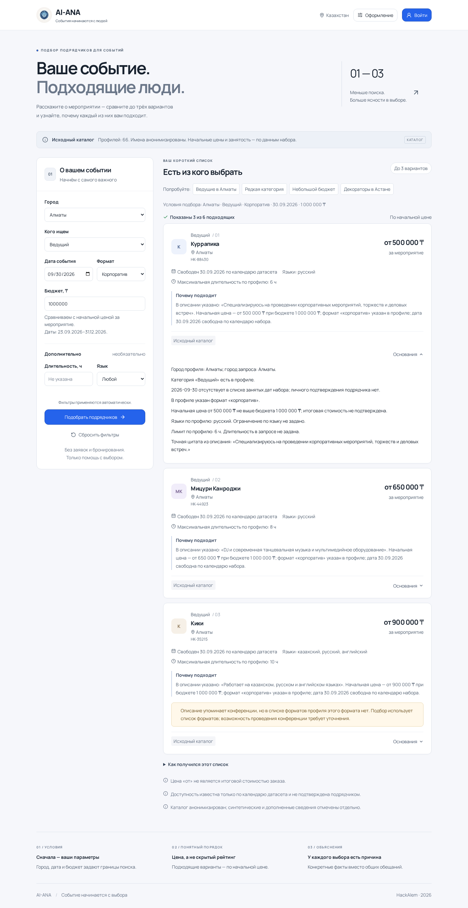
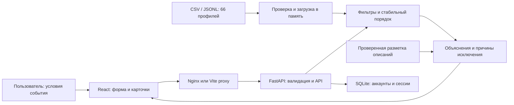

# AI-ANA

**Подбор event-подрядчиков в Казахстане с проверяемыми объяснениями.** Решение хакатон-задачи **#79-lite**: 66 исходных профилей, до трёх карточек в ответе, конкретные причины выбора и отсутствия результата.

[Запуск](#установка-и-запуск) · [Живая проверка](#как-проверить-решение) · [Алгоритм](#как-работает-решение) · [Ограничения](#ограничения)



## Для кого и какую проблему решает

Организатор уже знает город, формат мероприятия и нужную категорию, но должен вручную сравнить цены, занятость и условия подрядчиков. AI-ANA помогает выбрать из существующего каталога: сокращает список до трёх подходящих вариантов и объясняет каждый выбор. Сервис рассчитан на организаторов мероприятий, HR- и офис-менеджеров, а также людей, которые готовят собственное событие.

## Что реализовано

| Требование | Поведение приложения |
|---|---|
| Входные данные | Обязательны город, дата, формат мероприятия, категория и бюджет в тенге; язык и длительность опциональны |
| До трёх карточек | Имя, категория, город, начальная цена и объяснение из 1–2 предложений; раскрываемые «Основания» позволяют проверить факты |
| Занятость | Подрядчики с выбранной датой в `busy_dates` исключаются до формирования карточек; площадки проверяются так же, как люди |
| Меньше трёх результатов | Показываются только подходящие профили, их количество и причины исключения остальных |
| Три разных исхода | «Подобрали», «В городе нет такой категории» и «Категория есть, но условия не проходит никто» явно различаются |
| Повторяемость | При одинаковых данных и параметрах порядок одинаков: начальная цена, затем идентификатор |
| Смена даты | При изменении только даты интерфейс объясняет, кто стал занят, а кто просто вышел из первых трёх |
| Честность данных | Синтетические профили, дополненные города и цены отмечены; отсутствие сведений не заменяется выдуманными преимуществами |

Дополнительно работают примеры запросов, автоматический подбор через 400 мс после изменения формы, немедленный запуск кнопкой, отмена устаревших запросов, ошибки у полей и повтор после технического сбоя. Интерфейс адаптивный, цветовой акцент настраивается и сохраняется в браузере.

Есть регистрация, вход и редактирование имени и города; аккаунты сохраняются в SQLite. **Для подбора регистрация не нужна.** Эти дополнительные функции не меняют правила отбора.

## Как работает решение

1. Пользователь задаёт условия или выбирает готовый пример. Браузер проверяет поля и отправляет `POST /api/recommendations`.
2. FastAPI повторно проверяет запрос. Каталог заранее загружен и проверен при запуске сервера.
3. Сначала выбираются город и категория. Затем проверяются свободная дата, формат и бюджет; язык и длительность проверяются, если они заданы.
4. Подходящие профили сортируются по начальной цене и нормализованному идентификатору; в ответ попадают первые три. Это воспроизводимый порядок, а не оценка качества подрядчика.
5. Сервер составляет объяснения из проверенных фрагментов описаний и полей профиля, добавляет основания, предупреждения и причины исключения. Браузер показывает карточки либо объяснённый пустой результат.

Разметка описаний привязана к исходному тексту и контексту профиля: проверяются хэш и наличие цитаты. При недостаточном описании используются доступные структурированные сведения. Текст описания не исполняется как инструкция. Правила подробно описаны в [документации подбора](docs/matching.md).

## Технологии

| Компонент | Используется |
|---|---|
| Интерфейс | TypeScript 7.0.2, React 19.3.0, Vite 8.3.0, Tailwind CSS 4.3.3, React Hook Form 7.88.0, Zod 4.6.5 |
| Сервер | Python 3.13, FastAPI 0.141.1, Pydantic 2.13.5, Uvicorn 0.53.0 |
| Данные | CSV/JSONL для каталога, JSON для разметки объяснений, SQLite для аккаунтов и сессий |
| Запуск | Docker Compose, Nginx; для разработки — Uvicorn и Vite |
| Проверки | pytest 9.1.1, Playwright 1.63.0 и Chromium |
| AI и внешние API | Внешние модели, эмбеддинги и LLM API не используются; объяснения формируются детерминированно |

Зависимости закреплены в [requirements.txt](backend/requirements.txt) и [package-lock.json](frontend/package-lock.json). NVIDIA/Brev, Supabase и облачное хранилище к приложению сейчас не подключены; ключи внешних сервисов для запуска не нужны.

## Архитектура проекта



Основные части: `frontend/src/` — интерфейс; `backend/app/catalog.py` — импорт; `matching.py` — отбор; `explanations.py` — объяснения; `main.py` — API; `auth.py` — аккаунты. Каталог подрядчиков и база аккаунтов хранятся отдельно. Браузер работает через API, исходный CSV ему не передаётся.

## Установка и запуск

### Через Docker

Нужны Git и **Docker Desktop либо Docker Engine с Compose**. Python и Node.js на компьютере не требуются. Первый запуск скачивает образы и зависимости.

```bash
git clone https://github.com/BAITC-Hacks/hack-3c47c506-ai-ana.git
cd hack-3c47c506-ai-ana
docker compose up --build -d --wait
```

| Адрес | Назначение |
|---|---|
| **http://localhost:8080** | Сайт |
| http://localhost:8080/docs | Интерактивная документация API |
| http://localhost:8080/health | Готовность API: ожидаются `ready` и 66 профилей |

Если репозиторий уже клонирован, выполните последнюю команду из его корня. Состояние и журналы:

```bash
docker compose ps
docker compose logs --tail=100
docker compose down
```

На новом компьютере база аккаунтов создаётся пустой; все 66 подрядчиков доступны сразу. Аккаунты хранятся в volume `auth-data` и переживают обычный `docker compose down`. Флаг `--volumes` удаляет эту базу. Настройки порта, HTTPS, независимых копий и переноса базы — в [инструкции Docker](docs/docker.md); шаблон — [.env.example](.env.example).

### Без Docker

Нужны **Python 3.13**, `venv` и **Node.js 20.19+ в ветке 20 либо >=22.12.0**. Проверенная локальная среда: Linux, Python 3.13.5, Node.js 20.19.2, npm 9.2.0. Из корня репозитория:

```bash
python3 -m venv backend/.venv
backend/.venv/bin/python -m pip install -r backend/requirements.txt
cd frontend
npm ci
cd ..
```

В первом терминале, из корня проекта:

```bash
backend/.venv/bin/python -m uvicorn app.main:app --app-dir backend --host 127.0.0.1 --port 8000
```

Во втором терминале:

```bash
cd frontend
npm run dev -- --port 5173 --strictPort
```

Откройте **http://localhost:5173**, API-документация — http://127.0.0.1:8000/docs. Оба процесса должны работать; остановка — `Ctrl+C`. Для просмотра сборки из `frontend/`: `npm run build`, затем `npm run preview -- --port 4173 --strictPort`; API должен оставаться запущенным.

Vite проксирует `/api` на порт 8000. `CATALOG_PATH` позволяет выбрать локальный CSV/JSONL; после смены данных нужно перезапустить API. Без Docker аккаунты хранятся в `data/auth/accounts.sqlite3`. Подробнее: [каталог](docs/catalog.md), [API](docs/api.md), [аккаунты](docs/accounts.md).

## Как проверить решение

Проверяйте на работающем сайте с исходным каталогом из 66 профилей. Для первых шести строк ниже формат — **корпоратив**, язык — **Любой**, длительность пустая, кроме явно указанных 5 часов.

| Сценарий | Действие и параметры | Ожидаемый результат |
|---|---|---|
| Плотная категория | «Ведущие в Алматы»: Алматы, Ведущий, 30.09.2026, 1 000 000 ₸ | Три из шести подходящих: **Куррапика → Мицури Канроджи → Кики** (`HK-88430`, `HK-44923`, `HK-35215`) |
| Другая дата | В предыдущем запросе изменить только дату на **01.10.2026** | Две карточки: Куррапика и Мицури; интерфейс указывает, что Кики занят на новую дату |
| Повторяемость | Нажать «Подобрать подрядчиков» ещё раз с теми же условиями | Те же две карточки в том же порядке; после возврата на 30.09.2026 — исходные три |
| Редкая категория | «Редкая категория»: Алматы, Декоратор, 23.09.2026, 2 500 000 ₸, **5 ч** | **Уинри Рокбелл и Франки**; два подходящих из двух, Франки помечен синтетическим; `max_hours = null` не исключает их |
| Нет подходящих | «Небольшой бюджет»: Алматы, Ведущий, 30.09.2026, **100 000 ₸** | Карточек нет, но категория есть; показаны причины исключения кандидатов |
| Нет категории | «Декораторы в Астане»: Астана, Декоратор, 23.09.2026, 2 500 000 ₸ | Отдельное сообщение: такой категории в каталоге города нет |
| Площадка и занятость | Вручную: Астана, Отель, корпоратив, 23.09.2026, 3 000 000 ₸, 5 ч; затем дата **25.09.2026** | Сначала Веджита (`HK-90012`), затем пустой результат с причиной занятости |

Раскройте «Основания» и сравните объяснения трёх ведущих без имён: они должны опираться на конкретные факты профилей. Дополнительно проверьте [запрос национальных ансамблей](docs/queries/national-ensemble.json): Алматы, Национальный ансамбль, свадьба, 24.09.2026, 500 000 ₸, без языка и длительности. Этот сценарий проверяет различимость объяснений при бедных описаниях и одинаковых цене, языке и лимите часов.

Чтобы повторить запрос напрямую к Docker-версии API, выполните из корня проекта:

```bash
curl --fail-with-body --silent --show-error \
  -H 'Content-Type: application/json' \
  --data-binary @docs/queries/corporate-host.json \
  http://localhost:8080/api/recommendations
```

При запуске без Docker замените адрес на `http://127.0.0.1:8000/api/recommendations`. Остальные запросы — в [docs/queries](docs/queries/). [Сценарий защиты](docs/demo-guide.md) содержит пояснение алгоритма и ответы на вопросы жюри.

### Автоматическая проверка и время ответа

Итог проверки требований 23.09.2026: **270 серверных и 39 браузерных проверок прошли**, production-сборка успешна. Пять локальных повторов дали среднее **59.4 мс** от отправки формы до готовой выдачи; начальная загрузка и ввод параметров не входят в замер. Проверены в том числе различимость объяснений ансамблей и все потенциально совместимые пары исходного каталога без имён/ID. [Результаты и границы проверки](docs/verification-requirements.md).

После установки локальных зависимостей выполните из корня репозитория:

```bash
cd backend
.venv/bin/python -m pytest -q
cd ../frontend
npx playwright install chromium
npm run test:requirements
```

Браузерный прогон собирает сайт и запускает отдельные API и preview на портах **8002 и 4174**; они должны быть свободны. Аккаунты создаются только во временной тестовой базе. На Linux Chromium может потребовать системные зависимости: `npx playwright install-deps chromium`.

Результаты сверки с требованиями, замеры скорости и границы проверки собраны в [отчёте по требованиям](docs/verification-requirements.md). Отчёты [этапа 7](docs/verification-stage7.md), [аккаунтов](docs/accounts.md) и [Docker](docs/docker.md#статус-проверки) описывают предыдущие прогоны. Их показатели относятся к соответствующим версиям и локальному окружению, а не к скорости будущего облачного размещения.

## Данные и интеграции

- **Основной источник:** предоставленный `hackathon dataset anonymized .csv` — 66 анонимизированных профилей, 17 категорий. Исходный файл сохранён; команда не добавляла профили в рабочий каталог.
- В исходном наборе **13 синтетических профилей**, **8 дополненных городов** и **18 дополненных цен**. Флаг `synthetic` не означает, что запись добавила команда: происхождение показывается отдельно.
- CSV содержит полные описания и занятые даты. HTML-превью служит справочным материалом; сокращённые описания и сводные числа из него не подменяют исходные данные.
- Импорт поддерживает CSV и JSONL. Производный `data/derived/catalog.jsonl` — альтернативное представление того же каталога; одновременно загружать оба файла не нужно.
- `backend/app/data/profile_facts.json` содержит разметку оснований и предупреждений, проверяемую относительно исходных описаний. Подробности происхождения — в [описании каталога](docs/catalog.md).
- Собственный HTTP API связывает сайт и FastAPI. Supabase, NVIDIA API и другие внешние сервисы не вызываются; отправки профилей в модель нет. SQLite используется только для аккаунтов и сессий.

## Ограничения

- Календарь фиксирован: **23.09.2026–31.12.2026 включительно**. Доступность известна только по датасету и не подтверждается подрядчиком в реальном времени.
- Цена «от» не равна окончательной стоимости. `max_hours = null` означает, что услуга не привязана к присутствию и фильтр часов не применяется; это не обещание неограниченной работы.
- Объяснения ограничены фактами набора. Для нового или изменённого описания может потребоваться обновить разметку; если данных для отличия профилей недостаточно, сервис сообщает об этом, а не придумывает преимущество.
- Каталог загружается в память при старте API. Нет автоматической синхронизации календарей, редактирования каталога через сайт или подключения к облачной базе.
- Нет бронирования, заявок, оплаты и уведомлений подрядчикам. Аккаунты не сохраняют историю подборов; город профиля не подставляется в форму. Подтверждение email, восстановление/смена пароля и удаление аккаунта не реализованы.
- Проверки выполняются локально на небольшом каталоге; высокая параллельная нагрузка, публичная сеть и все семейства браузеров не проверены. Нативный запуск на Windows не проверялся.

## Deployed-версия

**Публичная deployed-ссылка не настроена.** Для живой проверки используйте локальный запуск через Docker: **http://localhost:8080**. Этот адрес доступен на вашем компьютере; текущий Compose публикует порт только на `127.0.0.1`. Порядок настройки HTTPS и внешнего доступа описан в [docs/docker.md](docs/docker.md).

## Дополнительная документация

[Алгоритм](docs/matching.md) · [Каталог](docs/catalog.md) · [API](docs/api.md) · [OpenAPI](docs/openapi.json) · [Docker](docs/docker.md) · [Аккаунты](docs/accounts.md) · [Демонстрация](docs/demo-guide.md) · [Проверка требований](docs/verification-requirements.md) · [История этапов](docs/progress.md)
